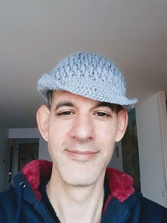
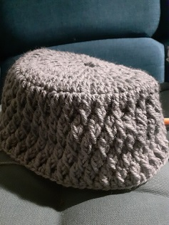
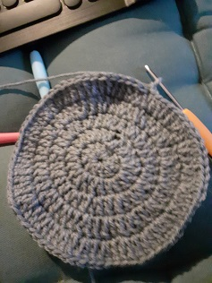

# Coffee, music, my yarn and crochet hooks

_March 23, 2021_

Day's work done. Put on some music, make a coffee. Hope it won't keep me up later. Move to the couch with my crochet hooks and my yarn. Either continue the previous days' project or put a slip knot into a strand and chain stitches until some new project starts to form.

Why do I do this?

##  Economics?

I'm not the fastest nor the slowest crocheter. At my pace, if this were my real job and paid what I generally make, I'd have to sell my wonky, flawed, plain beanie somewhere around 200-300€. No one in their right mind would ever pay that. If anyone was prepared to, I'd talk them out of it. In a rational market, my beanie is probably worth less than the yarn it's made from. 

Taylorization, mechanization and automation collude to ensure that my talents are better applied elsewhere.

In my case, from an economic standpoint, crocheting makes no sense. As I wind my way through stitch after stitch, I am not producing rational value. My best bet would to give these projects to friends for their birthdays with explanations of how long it took me to make them, because friends are supposed to value my time differently than an employer or client does. They're supposed to care that I care enough to spend time on them. That said, none of my friends want my crochet pieces. I don't blame them.

## Builder Satisfaction?

Is it about feeling useful, in a basic, by-my-own-bootstraps sense? My real job involves a few layers of abstraction, enough of them that I have a hard time explaining to people outside the field what it is I do exactly. Crochet, on the other hand, is very concrete. When my crochet project is done, I'm holding in hand a physical object whose elasticity masks the imperfections in my technique, enough to make me proud of it. I made this. And unlike cooking, it'll still be tangible tomorrow and I can then feel proud all over again.

If I were stranded in the wilderness somewhere, and somehow managed to fashion yarn out of plant fiber, I'd only have to spend the first 3 months or so naked. Maybe 4 or 5 months. The point being: crochet is a valuable skill to have. Almost every physical object that surrounds us in our home got there because we exchanged money for it. We tend to define ourselves by our taste, by our discerning purchasing habits, and it's satisfying when even a minute fraction of our possessions is the fruit of our own labor.

That said, if the builder's satisfaction were the only reason I crocheted, I'd really only have to do it once, to prove I can. so it's not that. Not entirely, anyway.

## Getting better at something, anything?

Crochet can be a little complicated at first. Your fingers aren't used to the sequence of movements that you need to chain. There are basic stitches, but more complicated ones, too. At first: you're slow. But you know that it's possible, because crochet is a thing people do, so you doggedly keep at it until your pieces start to look passably good. Then you make them look even better. Then you mix colors and try different stitches as befit different projects. As you become more practiced, you get faster. You start to acquire your own crochet personality, your favorite stitches, your own toolbox of patterns for different projects.

You acquire a signature. You reach a point where a piece is identifiably yours.

Learning and perfecting a skill can be inebriating. It really doesn't matter what skill it is. It taps into a deep well of gratification to think: yesterday I couldn't do this. and tomorrow I'll be even better at it.

But that's not the whole story either.

## ...or is it yarn replacing time as the measure of one's being. For a short yarn, anyway.

Hook yarn into stitches. Each one same as the one before it, same as the next one, with small variations appearing at the end of a row, pattern, or swathe.

I generally pride myself as an accurate time estimator. I'm that guy who can tell you, without looking at his watch, that's it's about 3:45 pm, and I'll get it right to within 5 minutes. When I'm crocheting, though, my time assessment flies out the window. I might start around 7 pm, and next time I look up it's 2 am and time for bed. I didn't feel those hours slip by.

For this segment of the day, the series of instants that make up consciousness is measured not in seconds within minutes and minutes within hours, but by stitches within rows and rows within swathes. To me, there's something magical about that, the way a mechanical sequence of knotting yarn will aborb me, disconnect me, until my eyelids droop and it's time to stop.

But tomorrow, I'll do it all over again.