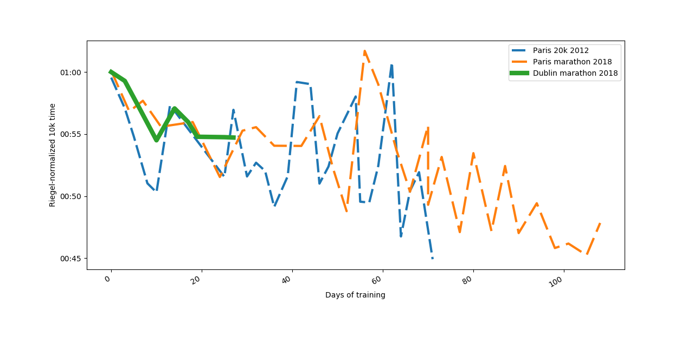

# We Always Start Slow

_René Ghosh, Sept 16 2018_

I've started training for the Dublin marathon in October, and of course I'm finding myself slow and sluggish.

You know, that inner voice that's saying, "_you're too old for this. You're going to embarrass yourself_." Deep down, you know you can do it, you've done it so many times before, but the feeling your body isn't cooperating stays with you the entire run.

I thought, why not prove to myself that I can? So I went over my training log and analyzed my normalized 10k runs
for my race training. Lo and behold, I've always been slow at the start of a cycle.	

Here's the graph. For each training cycle leading up to a race, I plotted the equivalent 10k times based on the [Riegel formula](https://en.wikipedia.org/wiki/Peter_Riegel#Race_time_prediction). If you're not familiar with this formula, it basically states that when you increase the length of your run, your overall performance goes down exponentially, by a factor of 1.06.

My conclusions:

- I'm _always_ slow during the first weeks of training
- Given 50 days of training, I can get my 10k time below 50 minutes
- With 100 days of training, I can get to a 45-minute 10k.

My training log goes all the way back to 2010, but for reasons of visual clarity and, well, cherry-picking data (I used to run all year-round, so when I started training I already had base fitness down), I've left out most of the training cycles.

