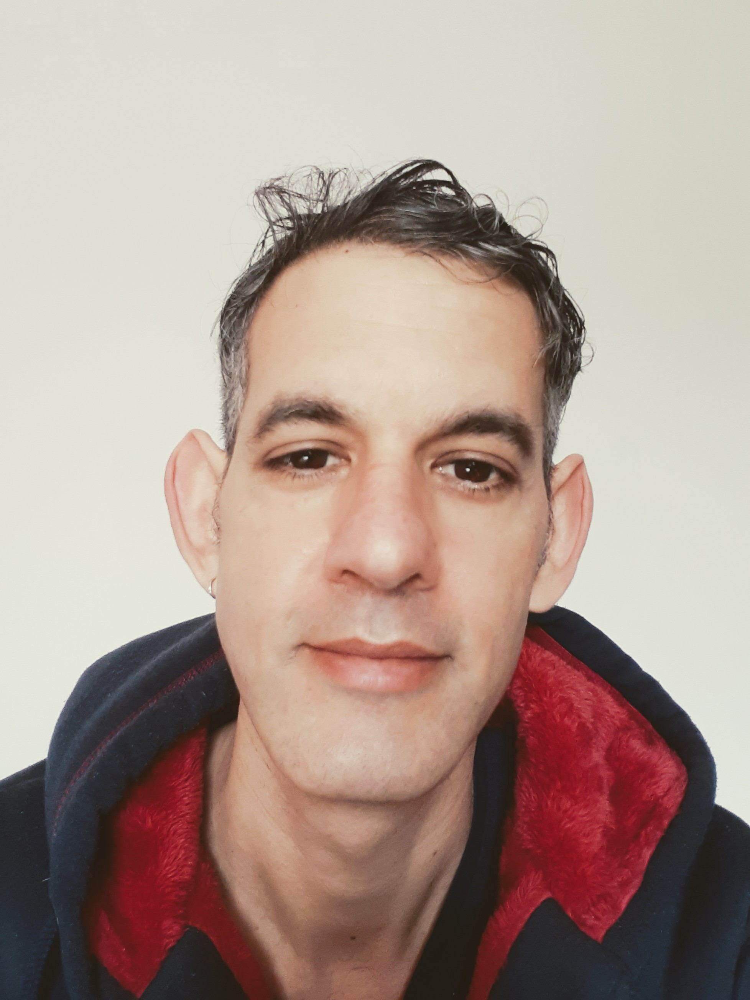



<h1 style="margin-top: 2em"> Books</h1>

I've written three novels and three short story collections. The short stories were written for stage performance, all falling neatly into the readable-aloud-in-five-minutes format, whereas the novels are sprawls. Reading either depends on where you are and how much mindspace you want to spare.



{{book}}


<h1> Music</h1>

My music is released under the name of my one-man-band, Satellite Ray.

I'm currently working on an electronic music album. I started making the music from a phone app but
have since switched to live-coding platforms.


{{track}}


<h1> Other work</h1>



{{link}}


<h1> Current work</h1>
I'm currently working on a collection of short stories with all the open mic stuff from 2018, and also
on a novel, a short one, about collecting sperm samples from a fictitious badger species in a fictitious country. The tentative title on the latter is "Sperm Hunters".

